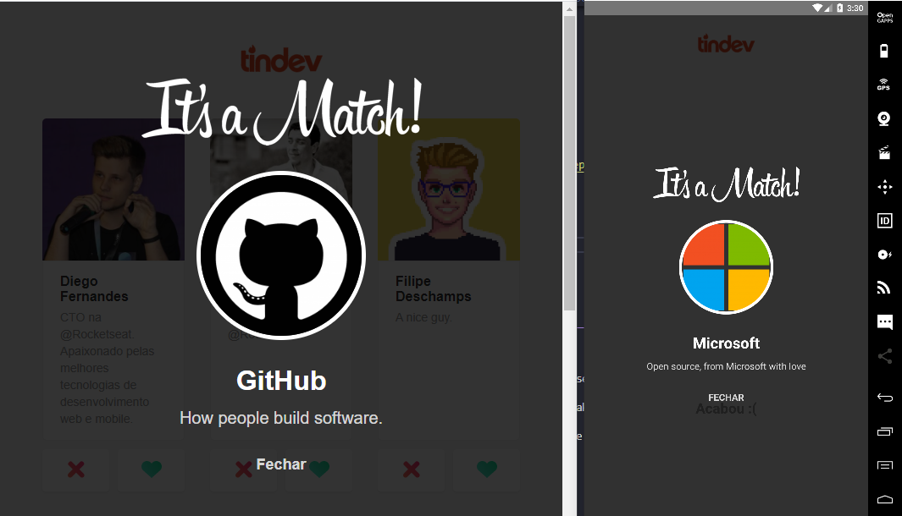

# Tindev
Projeto desenvolvido na omnistack 8

Site: https://tindev-front.herokuapp.com/



## Requisitos:
- [Nodejs](https://nodejs.org/en/)
- [Yarn](https://yarnpkg.com/getting-started/install)
- [Mongodb](https://www.mongodb.com/)
- [Sdkmanager](https://developer.android.com/studio#downloads)

## Instalação:

1) abra o terminal/prompt e digite ```git clone https://github.com/Lucas-Severo/Tindev.git```
2) Vá até a pasta do projeto com o comando ```cd Tindev```

## Instalando as dependências do backend
- ```cd backend```
- digite ```yarn```, assim o yarn irá procurar pelas dependências no arquivo [package.json](backend/package.json)

## Instalando as dependências do frontend
- ```cd frontend```
- digite ```yarn```, dessa forma o yarn instalará as dependências necessárias através do arquivo [package.json](frontend/package.json)

## Instalando as dependências do mobile
- ```cd mobile```
- digite ```yarn```, para instalar as dependências do arquivo [package.json](mobile/package.json)
- configure o sdk, [Configurando o ambiente do React Native](https://docs.rocketseat.dev/ambiente-react-native/introducao)

## Configuração:
- Após a instalação das dependências do backend é necessário informar a url do banco de dados no arquivo [server.js](https://github.com/Lucas-Severo/Tindev/blob/master/backend/src/server.js#L21)

```javascript
mongoose.connect('yourURL', 
                { useNewUrlParser: true,
                  useUnifiedTopology: true
                });
```

## Execução:

## Executando o backend

Primeiro, execute o seu backend em um prompt/terminal, para isso vá até o diretório com o comando ```cd backend``` e execute
```sh
yarn dev
```
Com isso, um servidor será aberto na url: [127.0.0.1:3333](https://127.0.0.1:3333)

## Executando o frontend

Com o server em execução vá até o frontend com ```cd frontend``` e digite
```sh
yarn start
```

com isso, uma aba no seu navegador principal será aberta e já estará consumindo as informações do backend

## Executando o mobile

Após a execução do servidor backend abra a pasta do mobile ```cd mobile```
conecte seu celular ou o emulador e digite: 

### Android
```sh
yarn react-native run-android
```
### IOS
```sh
yarn react-native run-ios
```

## Tecnologias:
- HTML, CSS, Javascript, Nodejs, Express
- ReactJs, ReactNative, Mongodb

## Licença:
[MIT](https://choosealicense.com/licenses/mit/)

